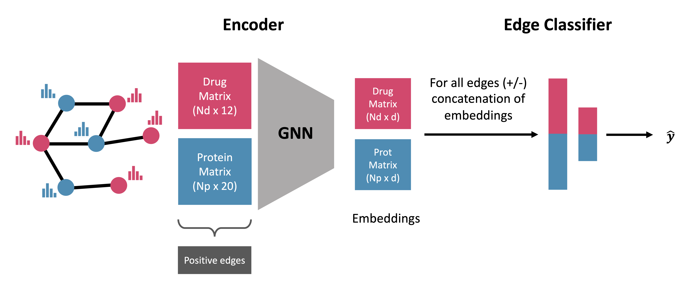

# GeNNius
GeNNius: An ultrafast drug-target interaction inference method based on graph neural networks

## Abstract
**Motivation**: 
Drug-target interaction (DTI) prediction is a relevant but challenging task in the drug repurposing field. In-silico approaches have drawn particular attention as they can reduce associated costs and time commitment of traditional methodologies. Yet, current state-of-the-art methods present several limitations: existing DTI prediction approaches are computationally expensive, thereby hindering the ability to use large networks and exploit available datasets; the generalization to unseen datasets of DTI prediction methods remains unexplored, which could potentially improve the development processes of DTI inferring approaches in terms of accuracy and robustness.

**Results**: 
In this work, we introduce GeNNius (Graph Embedding Neural Network Interaction Uncovering System), a Graph Neural Network-based method that outperforms state-of-the-art models in terms of both accuracy and time efficiency. Next, we demonstrated the prediction power of uncovering new interactions by evaluating not previously known DTIs for each dataset. Furthermore, we assessed the generalization capability of our model to train and test on different datasets, respectively, showing that the presented methodology potentially improves the DTI prediction task. Finally, we investigated qualitatively the embeddings generated by GeNNius, revealing that the GNN encoder maintains biological information after the graph convolutions while diffusing this information through nodes, eventually distinguishing protein families in the node embeddings.





## Summary of GeNNius architecture

GNN Encoder:

| Parameter type            | Value    |
|---------------------------|----------|
| Layer type                | SAGEConv |
| Number of hidden layer    | 4        |
| Activation function       | Tanh     |
| Aggregation type          | Sum      |
| Embedding dimension       | 17       |


NN-Classifier:

| Parameter type            | Value    |
|---------------------------|----------|
| Layer type                | Linear   |
| Number of layers          | 2        |
| Activation function       | ReLu     |
| Aggregation type          | Sum      |
| Embedding dimension       | 17       |

The model is traned with:

| Parameter type            | Value    |
|---------------------------|----------|
| Optimizer                 | Adam     |
| Learning rate             | 0.01     |
| Dropout (in GNN Encoder)  | 0.2      |


## Build docker 

Build image as (in the same folder as the Dockerfile):
```
docker build -t <image_name> .
# docker build -t pyg/gennius .
```

To run the container
```
docker run -dt --gpus all --name <container_name> <image_name>
```

-v flag may be added to work in the same folder (-v your_path/GeNNius/:/wdir/)


## Preprocessing

Using tsv files in PubChem and Uniprot Identifiers (with header ["Drug", "Protein"]) 
Run the following to generate the HeteroData object, with node features from RDKit and Amino Acid sequence of proteins.

```
python3 Code/data_preprocessing.py -d drugbank
```

Available datasets: drugabank, biosnap, bindingdb, davis, e, nr, ic, gpcr. 

If you want to run the data preprocesing for a custom dataset, add the tsv file in Raw/datasetname_dtis_pubchem_uniprot.tsv in format pubchem uniprot with headers Drug Protein. 

In general, files are lowercase and folders uppercase in this repo.


## Run the model

To run the following code selecting one dataset from {DrugBank, BioSNAP, BindingDB, DAVIS, E, IC, GPCR, NR}.

```
python3 Code/main.py -d <dataset> -e <embedding_dimension> (default is 17 as is the selected for GeNNius)
```

Our model works with a embedding dimension of 17. 
However, the code alows to test different embedding dimensions easily.


## Testing the capabilities of inferring unknown interactions

First, this code searches for each dataset the shared edges and also saves a tsv file with those edges for validation, needed in  validation script. 


```
python3 Code/compare_dtis_retrieve_unknown.py
```

Once we have the files 

```
df_validation_for_{database1.lower()}_originally_*.tsv
```

We can run 
```
python3 Code/validation.py
```
in it need to specify the dti dataset in L126.
Will retrieve the results in a tsv file. Please here modify in L126 the dataset you select for evaluation (will be updated to parse it).

If you run this for all datasets (and the repetitions you want, we did 10), and want to reproduce the figure from the main text, run the code:
```
figure_boxplot_inferring_dtis.py
```

## Testing generalization capabilities of GeNNius

First, need preprocessing of all datasets removing edges(with data_preprocessing_removing_repeated_edges.py for each 2 datasets).

All can be togheter executed by launching:

```
python3 Code/execute_preproc_repeated_edges.py 
```


Once all is preprocessed need to run:

```
python3 Code/execute4generalization.py 
```

This code generates a heatmap similar to the one presented in the article.


## t-SNES

Look code in Code/tsnes
for annotations
```
retrieve_annots_drugs.py
retrieve_annots_proteins.py
```
For plots:

```
colors_dict.py # this only the dict of colors
plot_tsnes_paper_feat.py
plot_tsnes_paper_embedding.py
tsne_pos_neg_val.py
```

## Add baselines here as well and generalization baselines

Folder Baselines/
includes pretrain protein embeddings

- simple_baselines/: includes the code for logistic regresion and random forest, the results in tsv of the gridsearch and of the model, and the generalization heatmap of the later (results in baseline_generalization/). 


- feature_corr/: includes code to check correlations in features and heatmap of results


- pretrain_protemb/: includes the test with protein embeddings downloades from uniprot
```
Code/data_preprocessing_prot.py # preprocess the code by downloading from .h5 file from uniprot
```
Once this step is done, the rest of the code is similar to that in main. 
In generalization, NR removed because errors (not enough edges to train). 
This code can be executed from pretrain_protemb.

You need to download the .h5 file from [Uniprot](https://www.uniprot.org/help/embeddings). We used the version available on March 2023.

## GridSearch

In folder GridSearchCodes/ example of the code used to generate the grid is presented, can be modified for selecting hyperparameters. 

- GridSearchCodes/gridsearch_GeNNius.py: Contains the functions of the model
- GridSearchCodes/generate_grid.py: calls the model specifying hyperparameters